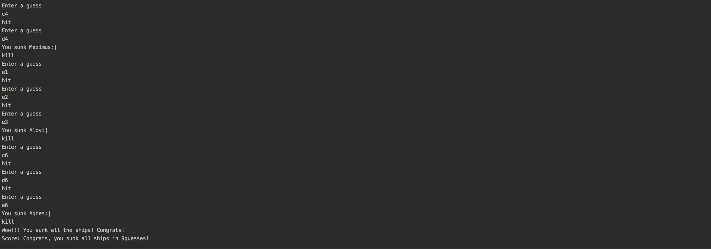

Battleship
-----------
Battleship - A command line game written in Java.
It randomly assigns 3 Battleships on a 7x7 board. It allows the user to guess the location.
On successful identification of each ship, it says "kill". When all the ships sink, games ends with a score.

Usage:
------
```
javac Battleship.java
java Battleship
```

Sample:
--------

